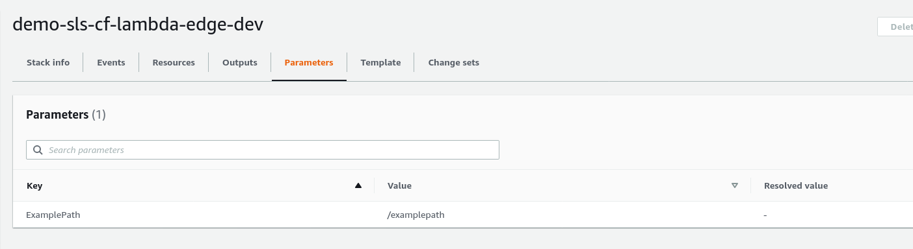
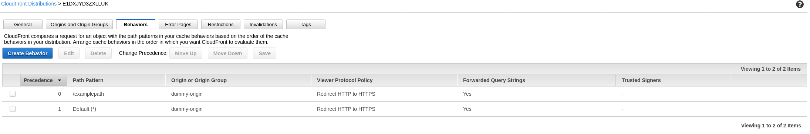
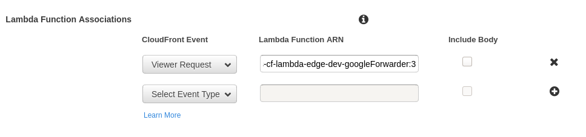

CloudFront Lambda@Edge SLS Plugin Reference Demo
================================================

This repository aims to demonstrate the functionality introduced by PR https://github.com/silvermine/serverless-plugin-cloudfront-lambda-edge/pull/48.

The setup is simplistic in nature, but essentially all paths that match the Distribution cache should be sent to the `example.org` Origin. The exception to this is our Parameterized value for `/examplepath` which will trigger our Lambda@Edge function to forward the user to `https://google.com`.

The code for the PR can be found in `src/vendor/serverless-plugin-cloudfront-lambda-edge`. A local file assignment is made in the `package.json` utilizing this code for the `@silvermine/serverless-plugin-cloudfront-lambda-edge`.

`serverless deploy` and allow time (10 to 20 minutes) for the Distribution to be created.

# Serverless Behavior Assignment Message:

# Stack Parameters:

# Distribution Cache Behaviors:

# Behavior Lambda association:

